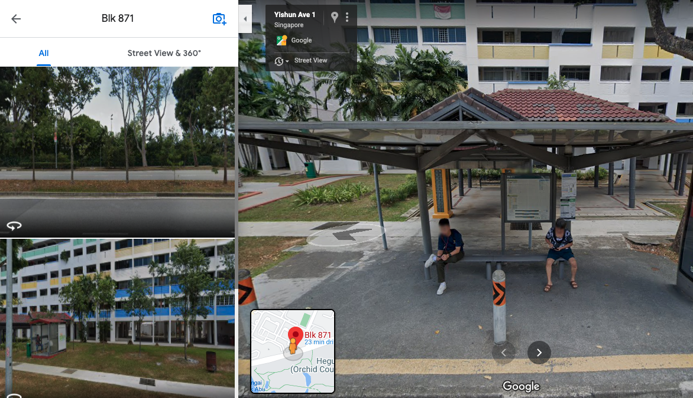

# CTF Name: Where was he kidnapped?

## Description
The missing engineer stores his videos from his phone in his private cloud servers. We managed to get hold of these videos and we will need your help to trace back the route taken he took before going missing and identify where he was potentially kidnapped!

You only have limited number of flag submissions!

Please view this [Document](https://public-download-files-1w4tlnkelo-stf-cat-1.s3-ap-southeast-1.amazonaws.com/OSINT+Challenges.zip) for download instructions.

Flag Format: govtech-csg{postal_code}

This challenge:
- Is eligible for Awesome Write-ups Award

## Flag
```
govtech-csg{760870}
```

## Detailed solution
3 video files were given for the challenge.
First video was showing a bus arriving that the engineer is taking to get to a place. 

The first video file shows of bus 117 that is going towards Punggol interchange on Yishun Avenue 2. Note that there is an MRT station in the background which means the engineer was either opposite of Yishun or Khatib station by referencing the bus service route.


Bus 117 service route can be found on transitlink website.
https://www.transitlink.com.sg/eservice/eguide/service_route.php?service=117
The second video shows the engineer getting off at a stop that is within a distant from the MRT. The video also shows two striking yellow colored columns which helped identify the stop number that the engineer got off at which is Blk 871.





The third video and second video were created only 2 minutes apart which means the engineer could not have walked far from the bus stop. 


The third video also shows a void deck with a table and a community garden in the background. By following these clues, blk 870 is narrowed down where the engineer was last spotted before being kidnapped. The postal code of blk 870 is 760870.


