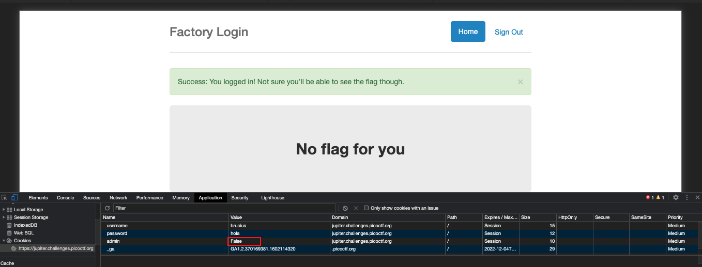

# logon

Point: 100

## Category

Web-Exploitation

## Question

The factory is hiding things from all of its users. Can you login as logon and find what they've been looking at? https://jupiter.challenges.picoctf.org/problem/44573/ (link) or http://jupiter.challenges.picoctf.org:44573

## Hint

Hmm it doesn't seem to check anyone's password, except for logon's?

## Solution

This challenge can be solved by using chrome's developer console to edit the admin value of the cookie as true for impersonating as an admin to grab the flag.

## Improvement

None