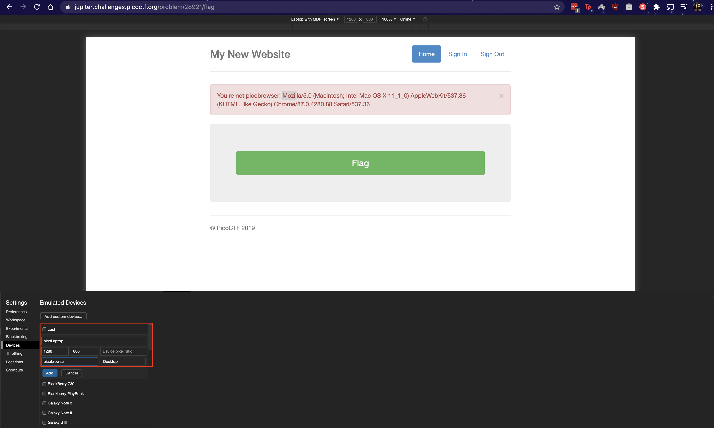

# picobrowser

Point: 200

## Category

Web-Exploitation

## Question

This secure website allows users to access the flag only if they are admin and if the time is exactly 1400. [link](https://jupiter.challenges.picoctf.org/problem/64751/) or http://jupiter.challenges.picoctf.org:64751

## Hint

Can cookies help you to get the flag?

## Solution

This challenge can be solved by using chrome's developer console to create a custom browser emulating as a pico browser to grab the flag.



## Improvement

Here's another way to grab the flag using curl command from terminal.
```bash
bruceymac% curl --user-agent "picobrowser" https://jupiter.challenges.picoctf.org/problem/28921/flag | grep picoCTF{
  % Total    % Received % Xferd  Average Speed   Time    Time     Time  Current
                                 Dload  Upload   Total   Spent    Left  Speed
100  2115  100  2115    0     0   1762      0  0:00:01  0:00:01 --:--:--  1762
            <p style="text-align:center; font-size:30px;"><b>Flag</b>: <code>picoCTF{s0lut1on_h3r3}</code></p>
```